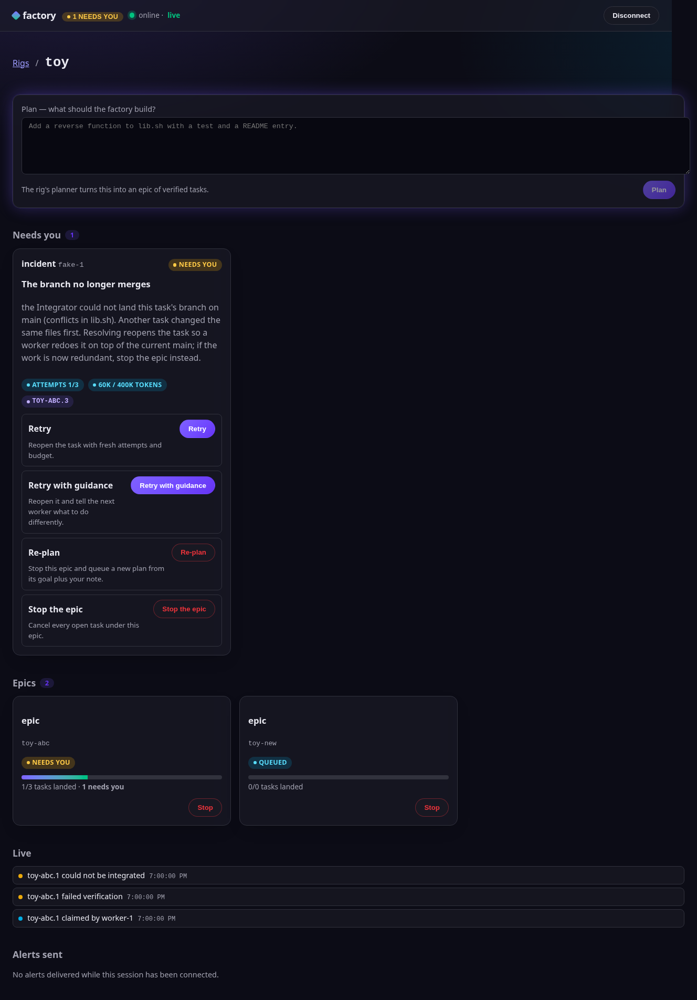

# software-factory-rs

[](https://github.com/The-Zoop-Troop/software-factory-rs/actions/workflows/ci.yml)
[](https://github.com/The-Zoop-Troop/software-factory-rs/actions/workflows/gardening.yml)
[](LICENSE)
[](rust-toolchain.toml)
[](Cargo.toml)
[](crates/xtask/src/main.rs)
[](docs/QUALITY_SCORE.md)
[](docs/design-docs/railway.md)
[](AGENTS.md)
[](https://github.com/The-Zoop-Troop/software-factory-rs/commits/main)
[](https://github.com/The-Zoop-Troop/software-factory-rs/issues)
[](CONTRIBUTING.md)

**Give it a plan; get back a verified, merged codebase.** An autonomous software factory that
runs coding agents (Claude Code, OpenCode against any OpenAI-compatible provider, or Codex)
inside a sandboxed rig, with no orchestrator to babysit, no unverified "done", and no agent
ever running loose on your machine.

- [Vision](#vision) · [Motivation](#motivation) · [How it works](#how-it-works) · [Quick start](#quick-start)
- [Configuration](#configuration) · [Build & test](#build-and-test) · [Deployment](#deployment) · [Operating a rig](#operating-a-rig)
- [Harnesses](#harnesses) · [Conventions](#conventions) · [Contributing](#contributing) · [Roadmap](#roadmap) · [Security](#security) · [License](#license)

## Vision

Coding agents are good at tasks and bad at projects. Left alone on a project they drift,
over-scope, and report success they have not earned. The usual fixes — an orchestrator agent,
permission prompts, a human reviewing every diff — reintroduce the bottleneck the agents were
meant to remove. This project bets on three inversions and one discipline:

1. **No orchestrator.** Work is a dependency graph in a ledger ([Beads](docs/references/beads.md)).
   Workers *pull* what is ready and hold a lease while they hold it. A dead worker's lease expires
   and the work returns. Nothing is a single point of failure or a bottleneck.
2. **Done means verified.** Every task is planned with an executable check *before* any code
   exists. A task advances only when that check passes in a clean checkout, and lands only after
   the project's own checks pass on the rebased result. Models propose; verification disposes.
3. **YOLO only inside a rig.** Agents get full tool access — that is where their productivity
   comes from — but only inside a rootless Docker container with default-deny egress and no host
   credentials. The container is the blast radius; the git worktree is the unit of concurrency.
4. **The factory's control flow is a typed railway.** Every role turns facts into decisions and
   effects through one total state machine; every failure is a typed value that says what to do
   next. That is why an incident is something an agent or a person can *act on*, not a log to read.

Full text: [`docs/product-specs/vision.md`](docs/product-specs/vision.md) ·
[`docs/product-specs/product.md`](docs/product-specs/product.md) ·
[`docs/design-docs/railway.md`](docs/design-docs/railway.md).

## Motivation

We wanted agent throughput on real repositories without handing an agent a laptop, a credential,
or the last word on whether something works — and we wanted the repository itself to be the
whole system of record, so that any agent (or person) can understand every decision from the
repo alone. The engineering approach is documented in
[`docs/references/harness-engineering.md`](docs/references/harness-engineering.md); the Rust
standard is the pinned [`rust-fp-skill`](skills/rust-fp-skill/SKILL.md) submodule.

## How it works

```
plan text ──▶ Planner ──▶ epic of task + verify beads (dependency graph in the ledger)
                               │
              ┌────────────────┴───────────────┐
              ▼                                ▼
   Worker (×N, stateless)             Verifier (no LLM)
   claim ready task ─▶ branch ─▶      run verify commands in a clean worktree
   harness session ─▶ commit ─▶       pass ─▶ mergeable ─▶ merge bead
   submit                             fail ─▶ reopen with output (attempt++)
                                                 │
                                                 ▼
                                      Integrator (no LLM)
                                      rebase ─▶ project checks ─▶ fast-forward ─▶ push
                                      (saga: push failure rolls main back)
   Steward (no LLM): reap expired leases, enforce budgets, repair gaps, close epics, log events
```

| Role | Responsibility | LLM |
|---|---|---|
| Planner | plan → tasks with acceptance criteria, verify commands, ordering | yes |
| Worker | claim a ready task, cut a branch, one harness session with a curated context packet, commit, submit | yes |
| Verifier | run the task's verify commands verbatim; pass/fail is a fact | no |
| Integrator | rebase onto main, run project checks, fast-forward, push; the only thing that pushes | no |
| Steward | leases, budgets, epic closure, merge-bead repair, event log | no |
| Console | A2A control plane over one or many rigs: plan, watch, inbox, resolve, stop — scoped tokens, audit, budgets, alerts, A2UI web UI | no |

**Crates** (dependency direction enforced by `cargo xtask lint-taste`):
`domain` (pure: ids, budgets, leases, plan validation, the task state machine) ←
`app` (workflows and ports: `BeadStore`, `Repo`, `Runner`, `Harness`, `Clock`) ←
`infra` (adapters: `bd`, `git`, `sh`, Claude/OpenCode/Codex, JSONL events) ←
`factory` (operator CLI) and `stewardd` (daemon). `xtask` holds the repository's own lints.
Map: [`ARCHITECTURE.md`](ARCHITECTURE.md). Generated references:
[state machine](docs/generated/state-machine.md) · [bead schema](docs/generated/bead-schema.md) ·
[CLI](docs/generated/cli.md).

## Quick start

Prerequisites: Linux, **rootless** Docker with Compose v2, and one credential for a harness
(see [Configuration](#configuration)). Nothing else runs on the host.

```sh
git clone --recurse-submodules https://github.com/The-Zoop-Troop/software-factory-rs
cd software-factory-rs
cp docker/rig.env.example docker/rig.env      # fill in one harness credential (gitignored)
docker/build.sh rust                           # base + runtime image + egress proxy (12 runtimes: see docs/references/runtimes.md)
docker compose up -d                           # egress, steward, verifier, integrator, worker
docker compose run --rm shell doctor           # tools, ledger, repo, credentials — with fixes
docker compose run --rm -e RIG_HARNESS=opencode plan \
  --text "Add a --verbose flag to the CLI, with a test and a README section."
docker compose exec steward factory watch      # progress per epic; `factory inbox` for incidents
docker compose up -d planner console           # remote control: A2A console on 127.0.0.1:7700 (+ browser UI at /)
```

Bring your project in with `RIG_REPO_URL` in `docker/rig.env` (cloned on first start) or by
seeding the `repo` volume (`docker compose run --rm shell`).

## Operator console



Every rig is operated from the browser (`http://127.0.0.1:7700/` with a console token): live epics, queued plans with planner progress, incidents with evidence and one-click options (retry, retry with guidance, re-plan, stop), an attention drawer across rigs, per-epic task tables and timelines, and the alerts the console delivered. Lit + Effect, embedded in the `console` binary; see [`docs/design-docs/web-console.md`](docs/design-docs/web-console.md).

## Configuration

Everything lives in `docker/rig.env` (gitignored; template in
[`docker/rig.env.example`](docker/rig.env.example)) and is injected at container start — never
baked into the image.

| Variable | Used by | Meaning |
|---|---|---|
| `CLAUDE_CODE_OAUTH_TOKEN`, `ANTHROPIC_API_KEY`, or `CLAUDE_AUTH_JSON` (base64 of `~/.claude/.credentials.json`) | `worker` (Claude), `plan` | Claude Code credential; `setup-token` preferred |
| `OPENCODE_PROVIDER_ID`, `OPENCODE_PROVIDER_NAME`, `OPENCODE_PROVIDER_BASE_URL`, `OPENCODE_API_KEY`, `OPENCODE_MODEL` | `worker-opencode`, `plan` with `RIG_HARNESS=opencode` | Any OpenAI-compatible provider; the entrypoint writes OpenCode's config from these |
| `OPENAI_API_KEY` or `CODEX_AUTH_JSON` (base64 of a logged-in `~/.codex/auth.json`), `CODEX_MODEL` | `worker-codex` (profile `codex`) | Codex CLI (Responses API only); the entrypoint seeds Codex's login from these |
| `RIG_HARNESS` | any role | `claude` (default), `opencode`, `codex` |
| `RIG_PREFIX`, `RIG_REPO_URL`, `RIG_MAIN`, `RIG_GIT_NAME`, `RIG_GIT_EMAIL` | entrypoint | ledger prefix, project clone, integration branch, commit identity |
| `FACTORY_LOG_FORMAT=json` | any role | one JSON object per log line |
| `RUST_LOG` | any role | tracing filter (default `info`) |

Egress is default-deny: `docker/egress/allowlist.base` plus the runtime's fragment and the project's `.factory/allowlist` are assembled by `docker/build.sh`. A project may also ship `.factory/Dockerfile` (own image `FROM` a runtime), `.factory/mcp.json` (MCP servers for all three harnesses) and its harness skills directories — see [`docs/references/runtimes.md`](docs/references/runtimes.md). Per-task budgets (tokens, wall clock, attempts)
default to `400000 / 45 min / 3` and live on the task bead.

## Build and test

```sh
cargo build && cargo test                         # or: cargo nextest run --workspace --all-features
cargo clippy --all-targets --all-features         # deny-tier lints (see Cargo.toml, clippy.toml)
cargo xtask lint-fp                               # the functional-Rust mechanical sweep (blocking in CI)
cargo xtask lint-taste                            # crate layering, file size cap, println!, pkill -f
cargo xtask lint-docs                             # every doc reachable from AGENTS.md; links resolve
cargo xtask gen-docs [--check]                    # regenerate docs/generated from code
cargo xtask coverage                              # llvm-cov, fails under 85%
cargo xtask quality [--check]                     # doc freshness (30 days) + measured quality block
cargo xtask ui-check [--e2e]                      # web console gate: tsc, eslint, vitest (browser), build, bundle budget, playwright
cargo xtask ui-build                              # build crates/console/ui/dist for embedding in the console binary
cargo mutants -p domain                           # mutation testing on the pure core (≥90% expected)
cargo test -p infra -- --ignored                  # live harness probes (need local claude/opencode/codex auth)
```

The exact set CI runs is in [`.github/workflows/ci.yml`](.github/workflows/ci.yml); the weekly
garbage-collection job is [`gardening.yml`](.github/workflows/gardening.yml).

## Deployment

One rig = one project; `factory rig create|list|destroy|doctor|backup|restore|console` runs many
rigs on one host with one console over all of them. The full runbook — prerequisites, first run,
remote control (console, `factory --rig`, Telegram bot, browser UI), TLS, service units,
telemetry, alerts, upgrade, backup/restore, logs, and troubleshooting — is
[`docs/DEPLOYMENT.md`](docs/DEPLOYMENT.md). The sandbox model (non-root,
`cap_drop: ALL`, internal network, allowlisted egress, no host mounts) is
[`docs/design-docs/rig-sandbox.md`](docs/design-docs/rig-sandbox.md).

## Operating a rig

```sh
factory doctor [--probe]            # is this host/rig able to run? --probe sends one token per configured harness
factory plan --harness opencode --model provider/model --text "..."   # or --file plan.md
factory work --harness claude --agent worker-1 --interval 10           # a worker loop
factory verify --interval 10        # verifier loop
factory integrate --check "cargo test" --remote origin --interval 10   # integrator loop
factory watch [--interval 30]       # tasks per epic by state, incidents, questions
factory inbox [--resolve <id> --note "..."]   # what needs a human; resolving reopens the task
factory bead show <id>              # a bead through the factory's typed view
bd ready | bd blocked | bd show <id>          # the ledger itself
factory --rig https://host/rigs/toy --token … watch|inbox|plan|stop|doctor   # the same, remotely, over A2A
factory telegram --bot-token … --chat <id>    # chat bot: /plan /watch /inbox /resolve /stop + push notifications
factory rig create toy --repo-url … --runtime python --harness codex          # many rigs on one host
```

Inside the rig the same commands are compose services (`steward`, `verifier`, `integrator`,
`worker`, `worker-opencode`, `worker-codex`, `planner`, `console`, `telegram`, `caddy`) and
one-shots (`plan`, `shell`, `doctor`, `watch`, `inbox`). Scale workers with `docker compose up -d --scale worker=3`. Every state transition is
appended to `.factory/events.jsonl` in the `ledger` volume.

## Harnesses

| `--harness` | Mechanism | Structured output | Provider |
|---|---|---|---|
| `claude` | `claude -p --output-format json` | `--json-schema` | Anthropic |
| `opencode` | `opencode serve` HTTP API, one server per session | `json_schema` format | any OpenAI-compatible endpoint (`OPENCODE_*`) |
| `codex` | `codex exec --json` | `--output-schema` | OpenAI Responses API |

They sit behind one `Harness` port ([`docs/design-docs/harness-port.md`](docs/design-docs/harness-port.md));
exact CLI/API contracts are in [`docs/references/`](docs/references/index.md).

## Conventions

- **The repository is the system of record.** [`AGENTS.md`](AGENTS.md) is a ≤100-line map;
  everything else lives under [`docs/`](docs/PLANS.md) with `Status`/`Verified` headers, exec
  plans with decision logs, and generated docs that CI checks for staleness.
- **Railway-oriented, functional Rust** per [`skills/rust-fp-skill`](skills/rust-fp-skill/SKILL.md):
  typed error tracks with actionable payloads, parse-don't-validate at every boundary
  (`Raw*` + `TryFrom`), injected time/IDs, exhaustive matches, fakes not mocks, property tests
  and mutation testing on the pure core. Enforced by `cargo xtask lint-fp`; justified
  exceptions carry `// fp-allow: <why>`.
- **Golden principles** and their enforcers: [`docs/design-docs/golden-principles.md`](docs/design-docs/golden-principles.md).
  Core beliefs: [`docs/design-docs/core-beliefs.md`](docs/design-docs/core-beliefs.md).
- **Work is tracked in Beads** (`bd`), never in TODO files: create the bead before the code,
  close it with a reason. Session start: `bd prime`.
- **Stored ledger metadata is a public boundary.** `META_VERSION` bumps only when a field's
  meaning changes; a fixture test keeps old shapes decoding.
- Commit messages are imperative and carry no attribution trailers.

## Contributing

See [`CONTRIBUTING.md`](CONTRIBUTING.md). In short: read `AGENTS.md`, claim or file a bead,
keep PRs small and short-lived, run the full gate locally (`cargo fmt --check`, `clippy`,
`nextest`, `deny`, `xtask lint-fp|lint-taste|lint-docs|gen-docs --check|coverage`), walk the
skill's [review checklist](skills/rust-fp-skill/references/code-review.md) before declaring done,
and record decisions in the exec plan, not in chat. Agent-authored PRs are welcome and expected.

## Roadmap

[`ARCHITECTURE.md §9`](ARCHITECTURE.md) — Phase 1: batch-then-bisect Integrator, flaky-test
detection, Planner re-planning on stalled epics. Phase 2: tree-sitter context packets, survey
turn for existing repos, prompt registry. Phase 3: gVisor, per-worker sub-containers, SCA/license
checks, multi-rig. Known debt: [`docs/exec-plans/tech-debt-tracker.md`](docs/exec-plans/tech-debt-tracker.md).
Quality grades: [`docs/QUALITY_SCORE.md`](docs/QUALITY_SCORE.md).

## Security

Threat model, what the rig does and does not protect, and how to report:
[`docs/SECURITY.md`](docs/SECURITY.md).

## License

MIT — see [`LICENSE`](LICENSE).
